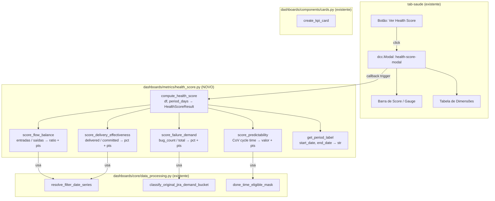
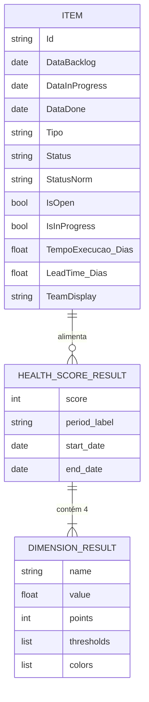
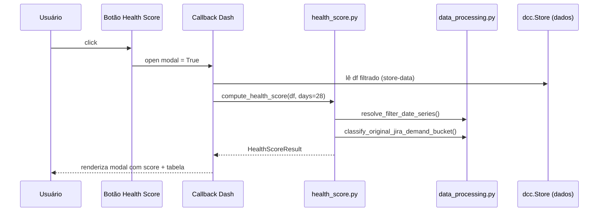

# Documento de Arquitetura — Health Score (Saúde do Fluxo)

> **Status:** Proposto | **Data:** 2026-04-24 | **Autor:** Winston (Architect)

---

## 1. Visão Geral Arquitetural

O **Health Score** é um painel de pontuação de saúde do fluxo de entrega, composto por 4 dimensões mensuráveis. Cada dimensão pontua 0, 50 ou 100 pontos, e o score final é a média simples. O painel cobre as **últimas 4 semanas** com datas explícitas.

### Decisão Estrutural Principal

O Health Score será implementado como um **modal acionado por um botão no topo da aba `tab-saude` existente** — sem criar nova aba ou nova rota. Isso preserva a coesão da aba de saúde e entrega UX idêntica ao mockup aprovado (modal com ×, barra de score, tabela de dimensões).

### Diagrama Geral de Fluxo

```
Usuário clica "Health Score" → Modal abre → Callback calcula 4 dimensões → Renderiza painel
```

---

## 2. Diagrama de Componentes



---

## 3. Stack Tecnológica e Justificativas

| Camada | Tecnologia | Justificativa | Alternativas Consideradas |
|--------|-----------|---------------|--------------------------|
| Cálculo de métricas | Python puro + pandas | Consistente com todo o projeto; sem nova dependência | NumPy direto (sem benefício aqui) |
| Modal UI | `dbc.Modal` (dash-bootstrap-components) | Já usado no projeto; componente nativo Dash; sem JS custom | `dcc.Overlay`, drawer lateral |
| Barra de score | `dcc.Graph` + Plotly bar horizontal | Controle total de cores (vermelho/laranja/verde); sem libs extras | `dash_daq.Gauge` (pesado), CSS puro |
| Tabela de dimensões | `html.Table` | Simples, leve, sem sortabilidade necessária | DataTable (overkill para 4 linhas) |
| Novo módulo | `dashboards/metrics/health_score.py` | Segue convenção do projeto; isolado; testável | Embutir em `time_metrics.py` (quebra SRP) |

---

## 4. Padrões de Design Adotados

### 4.1 Pure Function Score Pattern

Cada dimensão é uma função pura: recebe `pd.DataFrame` + parâmetros de período, retorna `(valor_atual, pontos: int)`. Sem efeitos colaterais, facilmente testável.

```python
def score_flow_balance(df, start, end) -> tuple[float, int]:
    entradas = count_arrivals(df, start, end)
    saidas = count_throughput(df, start, end)
    ratio = entradas / saidas if saidas > 0 else float('inf')
    pts = 100 if ratio <= 1.2 else (50 if ratio <= 1.5 else 0)
    return ratio, pts
```

### 4.2 HealthScoreResult Dataclass

```python
@dataclass
class DimensionResult:
    name: str
    value: float | str
    points: int
    thresholds: list[str]   # ["≤1.2×", "≤1.5×", ">1.5×"]
    colors: list[str]       # ["green", "orange", "red"]

@dataclass
class HealthScoreResult:
    score: int              # média das 4 dimensões
    dimensions: list[DimensionResult]
    period_label: str       # "23/Mar – 19/Abr/2026"
    start_date: date
    end_date: date
```

### 4.3 Callback Unificado (sem callback chain)

Um único `@callback` dispara quando o modal abre, recebe os dados já carregados via `dcc.Store`, e retorna todo o layout do modal. Evita waterfall de callbacks.

---

## 5. Modelo de Dados



### Mapeamento de Colunas por Dimensão

| Dimensão | Coluna(s) usada(s) | Observação |
|----------|-------------------|------------|
| Equilíbrio do Fluxo | `DataInProgress` (entrada) / `DataDone` (saída) | Conta eventos no período |
| Demanda de Falha | `Tipo` / `classify_original_jira_demand_bucket()` | Ver ADR-002 |
| Efetividade de Entrega | `DataInProgress`, `DataDone`, `StatusNorm` | Ver ADR-003 |
| Previsibilidade | `TempoExecucao_Dias` | CoV = std / mean |

---

## 6. Fluxos de Integração e APIs

### 6.1 Fluxo de Dados no Callback



### 6.2 Inputs do Callback

```python
@callback(
    Output("health-score-modal", "is_open"),
    Output("health-score-content", "children"),
    Input("btn-health-score", "n_clicks"),
    Input("btn-close-health-score", "n_clicks"),
    State("store-processed-data", "data"),   # store existente
    State("health-score-modal", "is_open"),
    prevent_initial_call=True
)
```

---

## 7. Estratégia de Segurança

| Risco | Mitigação |
|-------|-----------|
| Divisão por zero (saídas=0, WIP=0) | Guards explícitos em cada `score_*()` — retorna `(0, 0)` com label "Sem dados" |
| Período vazio (time novo, sem histórico) | `HealthScoreResult` com `score=None`, modal exibe aviso "Dados insuficientes" |
| Dados inconsistentes (DataDone < DataInProgress) | `done_time_eligible_mask` já filtra — reutilizar |

---

## 8. Estratégia de Testes

| Nível | O que testar | Como |
|-------|-------------|------|
| Unitário | Cada `score_*()` com DataFrames sintéticos | `pytest` + fixtures pandas |
| Integração | `compute_health_score()` com dados reais anonimizados | Snapshot test do HealthScoreResult |
| Visual | Modal abre/fecha, score exibido corretamente | Teste manual (Dash não tem headless padrão no projeto) |

**Casos críticos a cobrir:**
- Período com 0 saídas → Equilíbrio não calculável
- 0% bugs → Demanda de Falha = 100pts
- Todos os itens cancelados → Efetividade = 0pts
- Cycle time uniforme (CoV ≈ 0) → Previsibilidade = 100pts

---

## 9. Decisões Arquiteturais (ADRs)

### ADR-001: Modal vs Nova Aba

- **Status:** Aceito
- **Contexto:** Health Score pode ser superfície standalone ou integrada à aba de Saúde do Fluxo
- **Decisão:** Modal dentro de `tab-saude`, acionado por botão proeminente no topo do layout
- **Consequências:** (+) Sem nova rota/tab; UX cohesiva; (+) Acessa dcc.Store já carregado; (-) Modal é descartável — usuário não pode ancorá-lo lado a lado com gráficos

### ADR-002: Classificação de Bugs (Demanda de Falha)

- **Status:** Aceito
- **Contexto:** Não existe coluna `IsBug` explícita. A função `classify_original_jira_demand_bucket()` retorna `'failure'` para bugs
- **Decisão:** Usar `classify_original_jira_demand_bucket()` mapeando `'failure'` → falha. Fallback: `df['Tipo'].str.lower().str.contains('bug|incidente|hotfix')`
- **Consequências:** (+) Consistente com lógica existente; (-) Depende de correta configuração dos tipos no Jira. Documentar dependência.

### ADR-003: Itens "Abortados" (Efetividade de Entrega)

- **Status:** Proposto — requer validação dos status de cancelamento
- **Contexto:** Não existe coluna `IsCancelled`. Precisa mapear status como "Cancelado", "Removido", "Descartado"
- **Decisão:** Criar lista configurável `CANCELLED_STATUSES` em `health_score.py`. Default: `['cancelado', 'removido', 'descartado', "won't do", 'wont do']` (case-insensitive)
- **Consequências:** (+) Configurável sem code change; (-) Requer manutenção da lista quando novos status surgem

### ADR-004: Novo Arquivo vs Embutir em time_metrics.py

- **Status:** Aceito
- **Contexto:** Cálculos de health score poderiam ir em `time_metrics.py` (já tem métricas) ou em arquivo dedicado
- **Decisão:** Novo arquivo `dashboards/metrics/health_score.py`
- **Consequências:** (+) Single Responsibility; (+) Facilita testes isolados; (+) Não polui `time_metrics.py` com lógica de scoring/thresholds

### ADR-005: Período Fixo de 28 Dias

- **Status:** Aceito
- **Contexto:** Mockup especifica "últimas 4 semanas". Permitir configuração?
- **Decisão:** Período fixo de 28 dias como padrão; calcular `end = today`, `start = today - 28d`. Sem seletor de período no modal na V1.
- **Consequências:** (+) UX simples; (+) Consistente com mockup; (-) Sem análise histórica comparativa — evoluir em V2 se solicitado

---

## 10. Restrições e Dívida Técnica Conhecida

| Item | Tipo | Impacto |
|------|------|---------|
| Lista `CANCELLED_STATUSES` hardcoded | Dívida | Baixo — cobre maioria dos casos; evoluir para config externa |
| Sem filtro por time no Health Score V1 | Limitação de escopo | Médio — score é global, não por equipe |
| `classify_original_jira_demand_bucket()` pode ter edge cases | Risco | Baixo — já em produção para outras métricas |

---

## 11. Plano de Implementação (Etapas)

### Etapa 1 — Módulo de Cálculo `dashboards/metrics/health_score.py`

1. Criar dataclasses `DimensionResult` e `HealthScoreResult`
2. Implementar `score_flow_balance(df, start, end)`
3. Implementar `score_failure_demand(df, start, end)`
4. Implementar `score_delivery_effectiveness(df, start, end)`
5. Implementar `score_predictability(df, start, end)`
6. Implementar `compute_health_score(df, period_days=28) → HealthScoreResult`
7. Exportar em `dashboards/metrics/__init__.py`

### Etapa 2 — Componente Visual `dashboards/components/health_score_modal.py`

1. Criar `render_score_bar(score: int) → dcc.Graph` (barra Plotly horizontal colorida)
2. Criar `render_dimensions_table(dimensions) → html.Table`
3. Criar `render_health_score_modal(result: HealthScoreResult) → html.Div`
4. Exportar em `dashboards/components/__init__.py`

### Etapa 3 — Integração em `dashboard_full.py`

1. Adicionar `dbc.Modal` com id `health-score-modal` no layout de `tab-saude`
2. Adicionar botão `btn-health-score` no topo do layout
3. Registrar callback (ver seção 6.2)
4. Conectar ao `dcc.Store` existente

### Etapa 4 — Validação

1. Testar com dados reais: verificar scores fazem sentido
2. Validar lista `CANCELLED_STATUSES` contra status reais do projeto
3. Confirmar classificação de bugs via `classify_original_jira_demand_bucket()`

### Arquivos Afetados

| Ação | Arquivo |
|------|---------|
| **CRIAR** | `dashboards/metrics/health_score.py` |
| **CRIAR** | `dashboards/components/health_score_modal.py` |
| **MODIFICAR** | `dashboards/metrics/__init__.py` |
| **MODIFICAR** | `dashboards/components/__init__.py` |
| **MODIFICAR** | `dashboard_full.py` (layout tab-saude + callback) |

---

*Documento gerado por Winston — Architect (BMAD Method). Aprovação necessária antes da implementação.*
