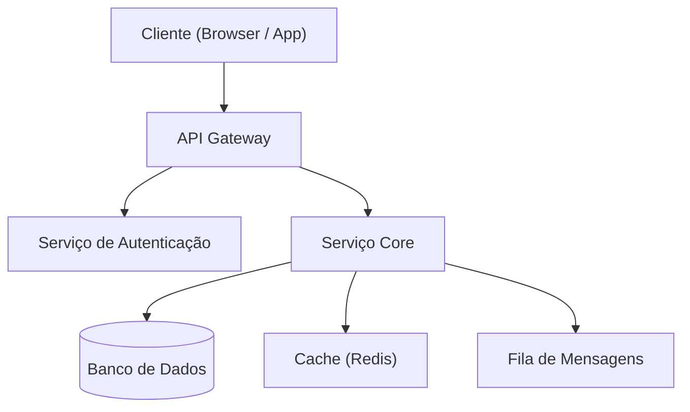
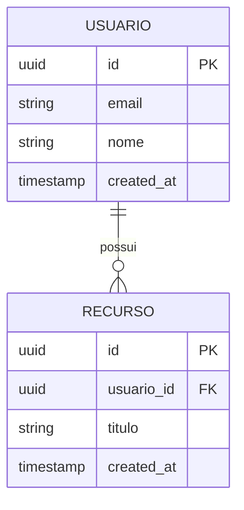

# Documento de Arquitetura — [Nome do Projeto]

> **Versão:** 1.0  
> **Data:** [AAAA-MM-DD]  
> **Autor:** Winston (Architect) — BMAD  
> **Status:** [ ] Rascunho  [ ] Em Revisão  [ ] Aprovado  
> **PRD de origem:** `docs/bmad/artifacts/prd.md`

---

## 1. Visão Geral Arquitetural

[Descrição em prosa da arquitetura: o estilo adotado (ex: monolito modular, microserviços, serverless), o racional principal e o que ela resolve em termos de requisitos não funcionais.]

---

## 2. Diagrama de Componentes

---

## 3. Stack Tecnológica

| Camada | Tecnologia | Versão | Justificativa | Alternativas Consideradas |
|--------|------------|--------|---------------|--------------------------|
| Frontend | [ex: Next.js] | [x.x] | [motivo] | [React SPA, Remix] |
| Backend | [ex: Node.js + Fastify] | [x.x] | [motivo] | [Express, NestJS] |
| Banco de Dados | [ex: PostgreSQL] | [x.x] | [motivo] | [MySQL, MongoDB] |
| Cache | [ex: Redis] | [x.x] | [motivo] | [Memcached] |
| Infra | [ex: AWS / GCP / Fly.io] | — | [motivo] | [—] |

---

## 4. Padrões de Design Adotados

- **[Padrão 1]:** [descrição e onde se aplica]
- **[Padrão 2]:** [descrição e onde se aplica]

---

## 5. Modelo de Dados

---

## 6. Fluxos de Integração e APIs

### API Interna

| Método | Endpoint | Responsabilidade | Auth |
|--------|----------|-----------------|------|
| POST | `/api/auth/login` | Autenticação | Pública |
| GET | `/api/recursos` | Listagem | JWT |

### Integrações Externas

| Sistema | Protocolo | Dados Trocados | Responsável |
|---------|-----------|---------------|-------------|
| [Sistema X] | REST | [payload] | [time] |

---

## 7. Estratégia de Segurança

- **Autenticação:** [ex: JWT com refresh token, expiração de 1h]
- **Autorização:** [ex: RBAC com roles: admin, user, readonly]
- **Dados em trânsito:** [ex: HTTPS/TLS 1.3 obrigatório]
- **Dados em repouso:** [ex: campos sensíveis criptografados com AES-256]
- **Validação de input:** [ex: Zod em todas as rotas de entrada]

---

## 8. Estratégia de Testes

| Camada | Ferramenta | Cobertura Mínima |
|--------|-----------|------------------|
| Unitário | [Jest / pytest] | 80% da lógica de negócio |
| Integração | [Supertest / Pact] | Todos os endpoints |
| E2E | Playwright | Fluxos P1 |

---

## 9. Decisões Arquiteturais (ADRs)

### ADR-001: [Título da Decisão]

- **Status:** Aceito
- **Data:** [AAAA-MM-DD]
- **Contexto:** [Por que esta decisão foi necessária]
- **Decisão:** [O que foi decidido]
- **Consequências:** [Impactos positivos e negativos desta escolha]

---

## 10. Restrições e Dívida Técnica

| Item | Tipo | Impacto | Plano de Resolução |
|------|------|---------|-------------------|
| [Item] | [Restrição / Dívida] | [Alto/Médio/Baixo] | [Sprint X ou backlog] |

---

## Changelog

| Versão | Data | Autor | Alterações |
|--------|------|-------|------------|
| 1.0 | [data] | Winston (Architect) | Versão inicial |
